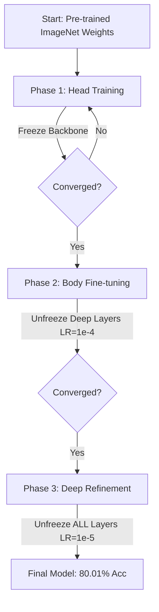

# Fine-grained Car Brand Classification: ResNet50 vs EfficientNetB4

> **A Comparative Study on the Stanford Cars Dataset using Adaptive Fine-tuning Strategies.**

## Overview

Fine-grained image classification is a challenging task due to subtle inter-class differences (e.g., distinguishing between a 2011 and 2012 model of the same car) and high intra-class variability.

This project investigates the performance of two state-of-the-art CNN architectures—**ResNet50** and **EfficientNetB4**—to classify **196 car categories** using the **Stanford Cars Dataset**.

### Key Contributions
1.  **Data Leakage Fix:** Identified and corrected a critical flaw in existing benchmarks where training data was mixed with testing data.
2.  **Adaptive Fine-tuning:** Proposed a **3-Phase Training Strategy** that recovered ResNet50 performance from a stagnant 55% to **80.01%**.
3.  **Visual Search Engine:** Developed a content-based image retrieval system using model embeddings.
4.  **Explainable AI:** Integrated **Grad-CAM** to visualize decision-making regions (headlights, grilles).

---

## Dataset & Preprocessing

We utilize the **Stanford Cars Dataset** containing 16,185 images. To ensure rigorous evaluation without data leakage, we strictly adhered to the following split:

* **Training Set:** 6,114 images (75% of original train set) - *Used for learning weights.*
* **Validation Set:** 2,030 images (25% of original train set) - *Used for early stopping.*
* **Testing Set:** 8,041 images - *Kept completely separate for final evaluation.*

### Model Configuration

| Model | Input Resolution | Rationale |
| :--- | :--- | :--- |
| **ResNet50** | **448 $\times$ 448** | Upscaled significantly to capture minute details (logos, headlights) that are crucial for distinguishing car years. |
| **EfficientNetB4** | **380 $\times$ 380** | Native resolution for optimal compound scaling balance. |

---

## Methodology: Adaptive Fine-tuning

We hypothesized that standard transfer learning is insufficient for this specific dataset. We implemented architecture-aware training strategies.

### ResNet50: 3-Phase Progressive Training
The baseline ResNet50 struggled to converge (Acc ~55%). We introduced a recovery phase:

## EfficientNetB4: 2-Phase Training
EfficientNet converges faster due to better feature reuse capabilities.
1. Phase 1 (Head): Freeze backbone, train classifier.
2. Phase 2 (Full): Unfreeze all layers with $LR=1e^{-4}$.

## Results & Performance
We achieved State-of-the-Art results for a corrected baseline.

### Performance Metrics
| Model | Precision | Recall | F1-Score | Accuracy | Inference Time |
|:---|:---:|:---:|:---:|:---:|:---:|
| **ResNet50** | 0.80 | 0.80 | 0.80 | 80.01% | ~75ms |
| **EfficientNetB4** | 0.88 | 0.87 | 0.88 | **87.60%** | ~90ms |

### Benchmark Comparison
| Method / Source | Model | Accuracy | Note |
|:---|:---:|:---:|:---|
| Original GitHub Claim | ResNet50 | 86.7%* | *Result invalid due to data leakage |
| Corrected Baseline (Ours) | ResNet50 | 55.0% | Standard training |
| **Proposed Method** | **ResNet50** | **80.01%** | 3-Phase Adaptive Strategy |
| **Proposed Method** | **EfficientNetB4** | **87.60%** | **Best Performance** |

## Explainable AI & Visual Search
1. Grad-CAM Visualization
We used Grad-CAM to validate that the model is looking at the right features.
  - EfficientNetB4: Consistently focused on discriminative parts like headlights and grilles.
  - ResNet50: Occasionally distracted by background noise (road, trees).(Place your Grad-CAM image here)
2. Visual Similarity Search
A demo application that utilizes the feature embeddings to find visually similar cars.
- Input: An image of a red sedan.
- Output: Top-5 most similar cars from the database (robust to angle and lighting).

## Future Work
- Object Detection: Integrate YOLOv8 to localize and crop the vehicle before classification to remove background noise.
- Vision Transformers (ViT): Explore self-attention mechanisms to better capture global context.
- Metric Learning: Implement ArcFace or Triplet Loss to improve separation between very similar classes.
- Model Compression: Apply Quantization for mobile deployment.

## Authors
Department of Computer Science, Srinakharinwirot University
- Kunanon Hareutaitam - kunanon.mas@g.swu.ac.th
- Tanawan Manamongkon - tanawan.first@g.swu.ac.th
- Ratthasas Chantra - ratthasas.chantra@g.swu.ac.th
- Korawich Chunoi - korawich.chunoi@g.swu.ac.th

## References
- [Stanford Cars Dataset (Kaggle)](https://www.kaggle.com/datasets/jutrera/stanford-car-dataset-by-classes-folder)
- [Keras Applications: EfficientNet](https://keras.io/api/applications/efficientnet/)
- [Keras Applications: ResNet](https://keras.io/api/applications/resnet/)
